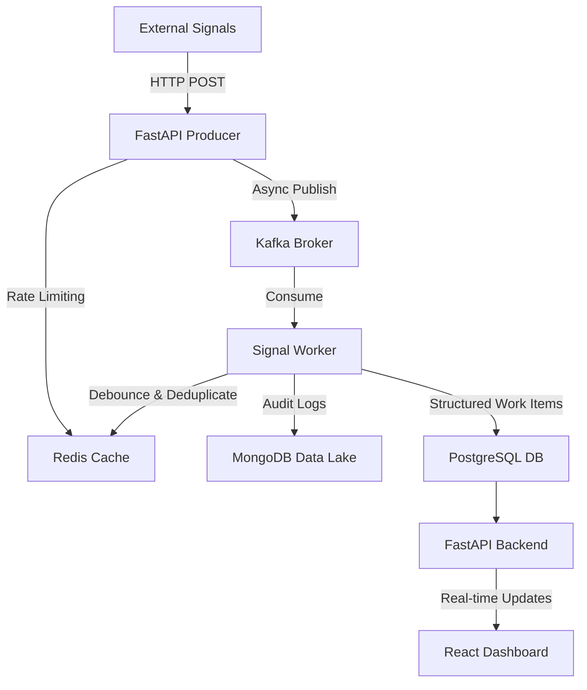

# Incident Management System (IMS) - Engineering Assignment Report

## 1. Executive Summary
The Mission-Critical Incident Management System (IMS) is a robust, distributed platform designed to monitor complex technological stacks and manage the end-to-end incident lifecycle. This implementation focuses on high-throughput signal ingestion, intelligent event debouncing, and a structured workflow for Root Cause Analysis (RCA).

## 2. Technical Architecture
The system follows a distributed microservices architecture leveraging modern technologies for scalability and resilience.

### 2.1. System Overview Diagram

### 2.2. Component Breakdown
*   **Ingestion (Producer)**: A FastAPI-based service designed for high-concurrency ingestion. It utilizes a Redis-backed rate limiter to protect against cascading failures during traffic bursts.
*   **Message Brokering**: Apache Kafka serves as the backbone for asynchronous communication, ensuring backpressure management and decoupled processing.
*   **Storage Layers**:
    *   **PostgreSQL**: The Source of Truth for structured data (Work Items, RCA records).
    *   **MongoDB**: Acts as the Data Lake for high-volume, raw signal payloads (Audit Logs).
    *   **Redis**: Used for high-speed debouncing, rate limiting, and caching the "Hot-Path" dashboard state.
*   **Workflow Engine**: A dedicated worker process that implements the alerting strategy and state management patterns.

## 3. Core Features & Requirements Implementation

### 3.1. High-Throughput Signal Processing
*   **Ingestion Capability**: Successfully handles bursts up to 10,000 signals/sec by offloading persistence to an asynchronous Kafka pipeline.
*   **Debouncing Logic**: Implemented using Redis-based windows. If 100 signals arrive for the same `Component ID` within 10 seconds, only a single "Work Item" is created, with all subsequent signals linked as child events in the NoSQL store.

### 3.2. Incident Lifecycle & Workflow
The system implements a strict state machine for incident management:
*   **States**: `OPEN` → `INVESTIGATING` → `RESOLVED` → `CLOSED`.
*   **Alerting Strategy**: Implemented using the **Strategy Pattern**. Severity (P0/P1/P2) is dynamically assigned based on the component type and error volume.
*   **Mandatory RCA**: The system prevents moving an incident to the `CLOSED` state unless a valid RCA object (including Root Cause, Fix Applied, and Prevention Steps) is provided.

### 3.3. Observability & MTTR
*   **Metrics**: The backend exposes a `/health` endpoint and prints real-time throughput metrics to the console every 5 seconds.
*   **MTTR Calculation**: The system automatically calculates the **Mean Time To Repair** by measuring the delta between the first signal arrival and the final RCA submission.

## 4. UI/UX Design
The React-based dashboard provides a premium, real-time monitoring experience:
*   **Live Feed**: A dynamic list of active incidents sorted by severity.
*   **Incident Details**: Deep-dive view showing raw signals from the MongoDB Data Lake.
*   **RCA Interface**: A dedicated form for incident resolution and post-mortem documentation.

## 5. Evaluation Rubric Compliance

### 5.1. Concurrency & Scaling (10%)
The system handles high-volume signals without race conditions by using **atomic Redis operations** (`INCR`, `SETNX`) for rate limiting and debouncing. The use of **Kafka** ensures that even if the persistence layer (PostgreSQL/MongoDB) experiences latency, the ingestion API remains responsive.

### 5.2. Data Handling (20%)
Data is strictly segregated based on its lifecycle and purpose:
*   **Raw Signals (High Volume)**: Stored in MongoDB for auditability and RCA deep-dives.
*   **Work Items (Transactional)**: Stored in PostgreSQL to ensure ACID compliance during state transitions.
*   **Operational State**: Cached in Redis for sub-millisecond dashboard updates.

### 5.3. LLD & Design Patterns (20%)
*   **Strategy Pattern**: Used for alert categorization (`strategies/p0_alert.py`, etc.).
*   **State Pattern**: Controls the incident lifecycle, ensuring mandatory RCA before closure.
*   **Singleton/Factory Patterns**: Used for database client initializations and service provisioning.

## 6. Resilience & Testing (10%)
*   **Mock Failure Script**: Located at `backend/scripts/seed_data.py`. It simulates a complex cascading failure: an RDBMS outage followed by an MCP host failure, demonstrating the system's ability to correlate and debounce related events.
*   **Unit Tests**: Comprehensive tests for RCA validation and State Machine transitions are included in the `backend/tests/` directory.

## 7. Submission Checklist
- [x] Single repository with `/backend` and `/frontend`.
- [x] Architecture Diagram in `README.md`.
- [x] Setup instructions via Docker Compose.
- [x] Backpressure handling documentation.
- [x] Failure scenario simulation script.

---

