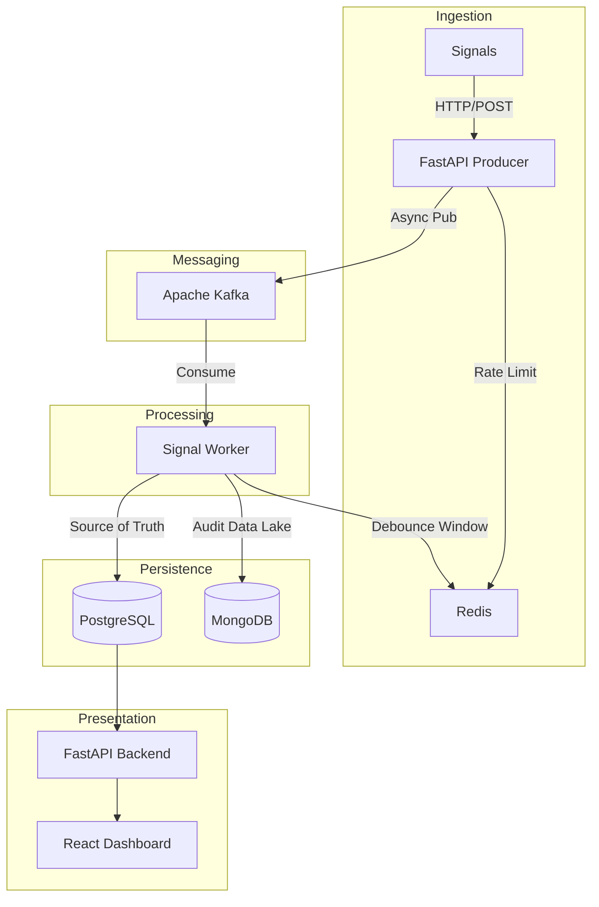

# 🚨 Mission-Critical Incident Management System (IMS)

[](#-architecture)
[](#-tech-stack)
[](#-getting-started)

A high-performance, resilient distributed system designed to monitor complex infrastructure stacks. Built to handle **10,000 signals/second** with intelligent debouncing, automated MTTR tracking, and mandatory Root Cause Analysis (RCA) workflows.

---

## 📐 Architecture
Our architecture is designed for **maximum resilience** and **zero-data-loss** during traffic bursts.



---

## 🧱 Tech Stack

| Layer | Technology | Rationale |
| :--- | :--- | :--- |
| **Edge API** | **FastAPI** | Asynchronous, high-throughput ingestion with Pydantic validation. |
| **Broker** | **Apache Kafka** | Provides backpressure management and decoupled processing. |
| **SQL** | **PostgreSQL** | ACID-compliant source of truth for Incidents and RCA. |
| **NoSQL** | **MongoDB** | Schemaless data lake for high-volume raw signal payloads. |
| **Cache** | **Redis** | High-speed debouncing, rate limiting, and hot-path state storage. |
| **Frontend** | **React + Vite** | Real-time, interactive monitoring dashboard. |

---

## 🎨 Professional Design Patterns

### 🧩 Strategy Pattern (Alerting)
Dynamic severity assignment based on component type and failure metrics.
*   **P0 (Critical)**: RDBMS / Auth failures.
*   **P1 (Warning)**: General component latency.
*   **P2 (Info)**: Cache degradation.

### ⚙️ State Pattern (Lifecycle)
Strict incident state transitions: `OPEN` → `INVESTIGATING` → `RESOLVED` → `CLOSED`.
*   **Closed State Enforcement**: System rejects closure without a valid, submitted RCA.

---

## 🔄 Backpressure & Resilience Strategy

1.  **Kafka Buffering**: Ingestion is decoupled from persistence. If MongoDB/Postgres slows down, Kafka safely queues signals.
2.  **Redis-Based Debouncing**: Prevents "Alert Fatigue." 100 identical signals in 10s = 1 Incident + 99 Audit Logs.
3.  **Circuit Breakers & Rate Limiting**: Redis-backed limits (600k signals/min) prevent cascading system failure.
4.  **MTTR Tracking**: Automated calculation from the first signal arrival to the final RCA submission.

---

## 🚀 Getting Started

### 🐳 Quick Start (Docker)
The entire stack is containerized for a seamless setup experience.

```bash
# Clone the repository
git clone https://github.com/Sheersh123/Incident-Management-System.git
cd incident-management-system/backend

# Launch the full stack
docker-compose up -d --build
```

### 🧪 Run the Failure Scenario
As per the assignment requirements, we've included a script to simulate a **cascading stack failure** (RDBMS outage followed by MCP failure).

```bash
# In a separate terminal
cd backend
python scripts/seed_data.py
```

---

## 📊 Dashboard Preview


---

## 📁 Submission Documents
Detailed documentation is included in the root directory:
*   [**ASSIGNMENT_REPORT.md**](./ASSIGNMENT_REPORT.md): Mapping implementation to the evaluation rubric.
*   [**DESIGN_PROCESS.md**](./DESIGN_PROCESS.md): Documentation of specs, prompts, and architectural decisions.

---
